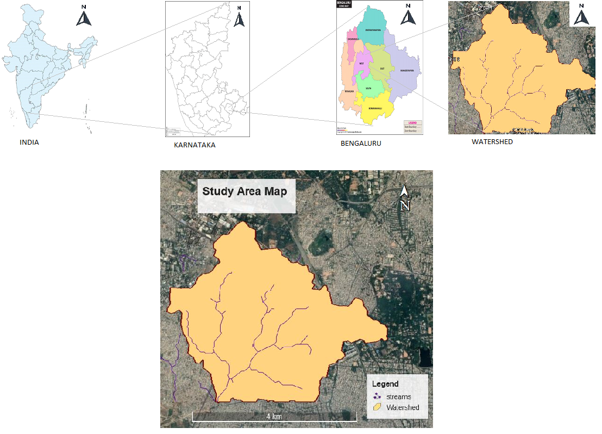
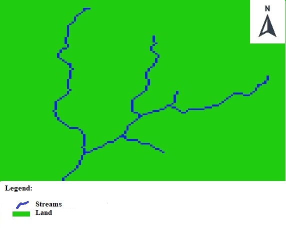
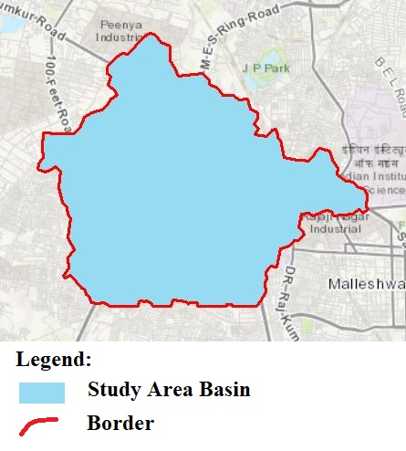
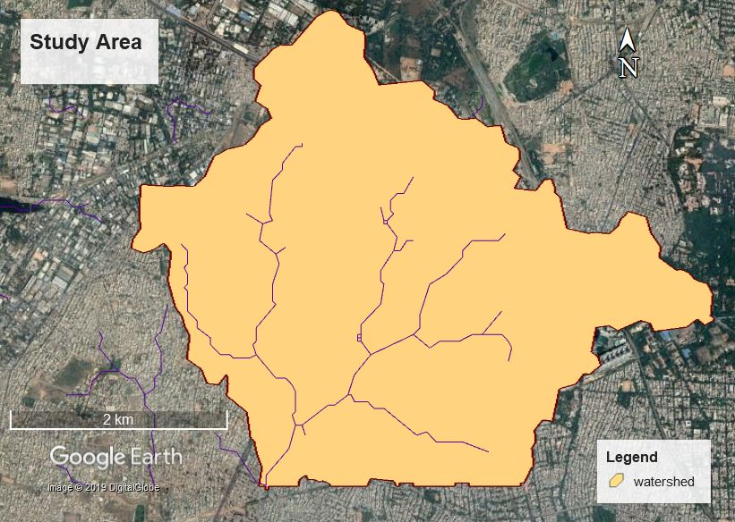
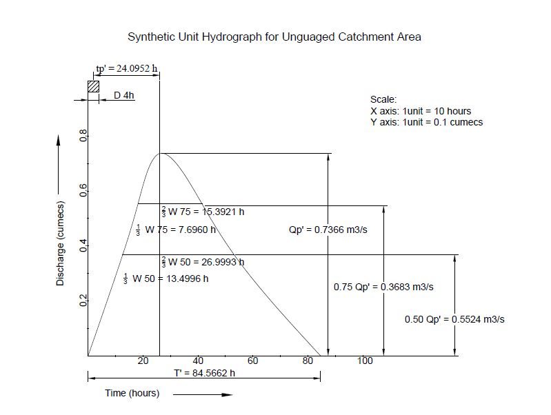
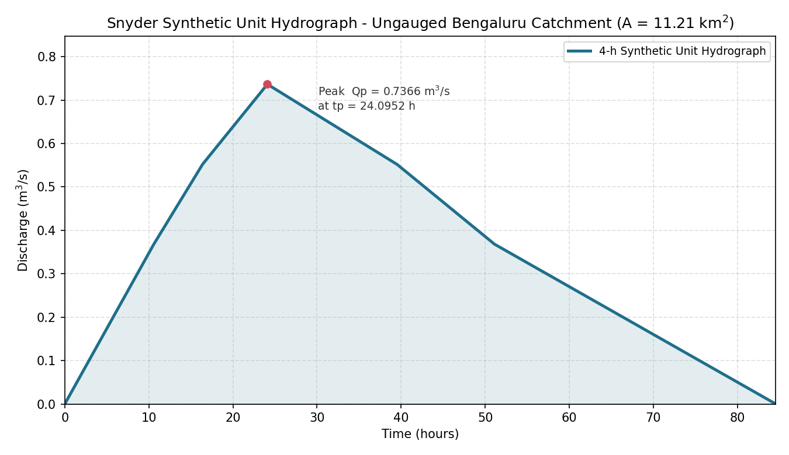

# Automated Watershed Delineation & Snyder Synthetic Unit Hydrograph for an Ungauged Catchment

A GIS + hydrology project that builds a complete spatial-to-hydrological pipeline for an
**ungauged urban catchment in Bengaluru, India** — from raw DEM to a finished 4-hour
Synthetic Unit Hydrograph (SUH) usable in flood-forecasting and water-management studies.

> **Project context:** This work was carried out as an academic engineering project. All
> maps, parameters, and figures in this repository are from that project.

---

## What this project does

Most basins in developing regions are **ungauged** — there is little or no observed rainfall
and streamflow data. Snyder's method derives a unit hydrograph from the *physical* characteristics
of a basin instead, making it possible to estimate flood response where no gauges exist. This
project implements that end to end:

1. **Acquire & condition terrain** — download and clip a USGS SRTM DEM, then remove sinks.
2. **Delineate the watershed** — derive flow direction, flow accumulation, and basin boundary.
3. **Extract physiographic parameters** — catchment area, longest stream length, centroid length.
4. **Compute Snyder parameters** — basin lag, peak discharge, base time, and UH widths.
5. **Build the Synthetic Unit Hydrograph** — a 4-hour SUH for the catchment.

## Tools used

`ArcGIS / ArcMap 10.3` (Spatial Analyst – Hydrology toolbox) · `QGIS` · `Google Earth Pro` ·
`AutoCAD (MASSPROP)` · `USGS Earth Explorer` · `Python` (matplotlib, numpy) for reproducible plotting.

## Study area

Watershed covering Yeshwanthpura, Laggere, Nandini Layout and Mahalakshmi Puram, Bengaluru,
Karnataka. Latitude 12°59′59″N–13°02′23″N, Longitude 77°30′59″E–77°33′57″E.
DEM: USGS **SRTM 1 Arc-Second Global**, tile `SRTM1N13E077V3`.



---

## Pipeline at a glance

| Stage | Tool | Output |
|-------|------|--------|
| DEM acquisition | USGS Earth Explorer | SRTM 1 Arc-Second tile |
| Sink removal | Fill | Depressionless DEM |
| Flow routing | Flow Direction → Flow Accumulation | Flow grids (threshold > 1000) |
| Basin extraction | Basin → Raster to Polygon | Catchment shapefile |
| Stream network | Raster Calculator → Raster to Polyline | Stream polylines |
| Geometry | Attribute Table → Calculate Geometry | Area = 11.21 km² |
| Cross-platform lengths | Layer→KML / Export→CAD | L, Lc in Google Earth Pro / AutoCAD |
| Hydrograph | Snyder's equations | 4-h SUH |

Key GIS outputs:





Full step-by-step workflow with every figure → [`docs/methodology.md`](docs/methodology.md).

---

## Results

**Physiographic parameters**

| Parameter | Symbol | Value |
|-----------|--------|-------|
| Catchment area | A | 11.21 km² |
| Longest stream length | L | 3.82 km |
| Centroid length | L꜀ | 2.13 km |

**Snyder parameters (4-hour SUH)**

| Parameter | Symbol | Value |
|-----------|--------|-------|
| Basin lag | t_p | 24.10 h |
| Regional constant | C_t | 12.85 |
| Peaking coefficient | C_p | 0.57 |
| Peak discharge | Q_p′ | 0.7366 m³/s |
| Discharge per unit area | q_p′ | 0.0657 m³/s/km² |
| Base time | T′ | 84.57 h |
| Width at 50% peak | W₅₀ | 40.50 h |
| Width at 75% peak | W₇₅ | 23.09 h |

Full derivations and formulas → [`docs/results.md`](docs/results.md).
Machine-readable values → [`data/snyder_parameters.csv`](data/snyder_parameters.csv).

**Synthetic Unit Hydrograph**

The original project hydrograph:



Reproducible reconstruction from the documented parameters
(`python scripts/plot_synthetic_uh.py`):



---

## Repository structure

```
.
├── README.md                       # this case study
├── report/                         # full project report (PDF, 32 pp.)
├── docs/
│   ├── methodology.md              # complete GIS + hydrology workflow, all 29 figures
│   └── results.md                  # Snyder calculations and formulas
├── figures/                        # all project figures (maps & tool outputs)
├── data/                           # catchment metadata + parameters (txt / csv)
├── scripts/                        # reproducible hydrograph plot
└── outputs/                        # generated figure
```

## Reproduce the hydrograph

```bash
pip install -r scripts/requirements.txt
python scripts/plot_synthetic_uh.py   # writes outputs/synthetic_unit_hydrograph_reconstructed.png
```

## Skills demonstrated

GIS-based hydrological modelling · DEM processing & watershed delineation in ArcGIS/QGIS ·
spatial data conditioning and vector extraction · cross-platform geospatial interoperability
(KMZ/DWG) · empirical hydrology (Snyder's method) · reproducible analysis in Python.

## License

Code and documentation in this repository are released under the [MIT License](LICENSE).
The report and figures are the author's academic work, shared for portfolio purposes.

— *Author: &lt;Your Name&gt;*
