# Methodology — Full Workflow

Complete step-by-step pipeline from DEM acquisition to the Synthetic Unit Hydrograph, with every figure from the project. Software: ArcGIS / ArcMap 10.3 (Spatial Analyst – Hydrology toolbox), Google Earth Pro, AutoCAD, and USGS Earth Explorer.

## 1. Acquire the DEM (USGS Earth Explorer)

A 1-Arc-Second Global SRTM DEM is sourced for the study coordinates. In Earth Explorer, the area of interest is defined under Search Criteria, then `Digital Elevation → SRTM → SRTM 1 Arc-Second Global` is selected and the matching tile downloaded (`SRTM1N13E077V3`, published 23 Sep 2014).

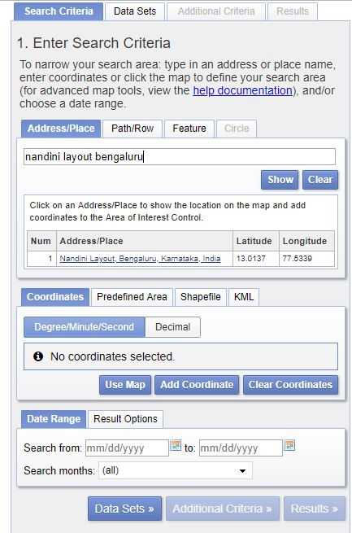

*Figure 3.4.1 — Entering Search Criteria (USGS Earth Explorer)*

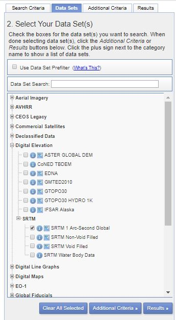

*Figure 3.4.2 — Selecting Data Sets (SRTM 1 Arc-Second Global)*

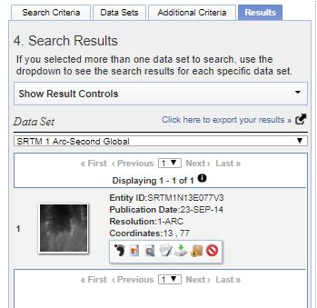

*Figure 3.4.3 — Available DEMs Shown*

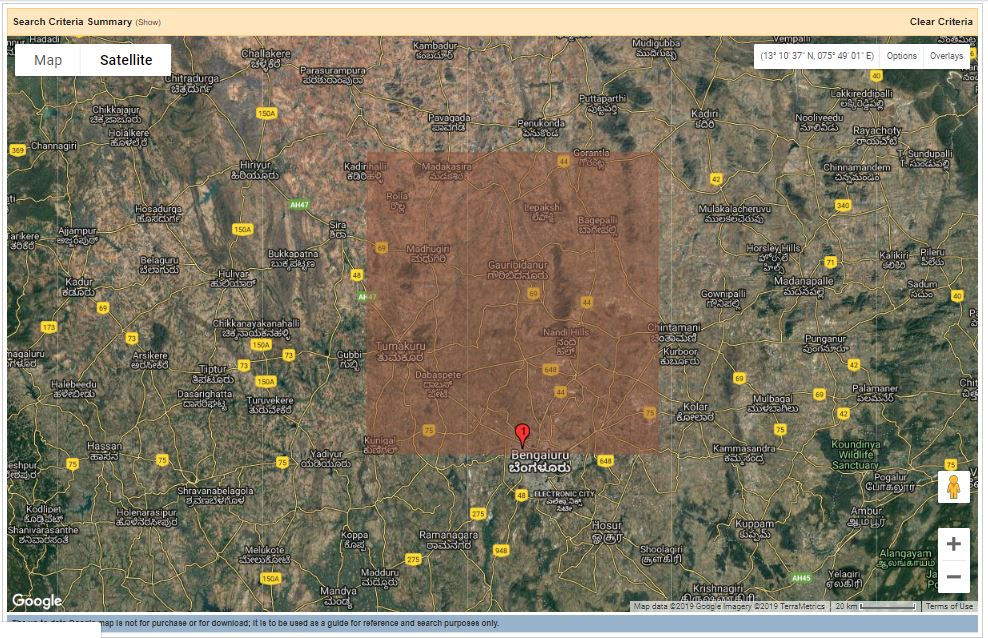

*Figure 3.4.4 — Foot Print of DEM*

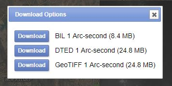

*Figure 3.4.5 — DEM Download Options in Various Formats*

## 2. Delineate the watershed (ArcGIS Hydrology toolbox)

The downloaded DEM is clipped to the area of interest and processed through the standard hydrology chain. The overall sequence is summarised below.

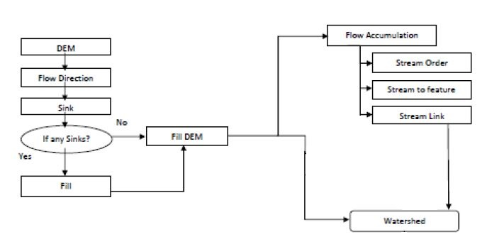

*Figure 3.5.1 — Flowchart of Delineation*

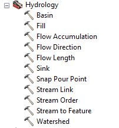

*Figure 3.5.2 — Hydrology Toolbox*

**Fill** — removes sinks (cells with no downstream flow) to produce a depressionless DEM.

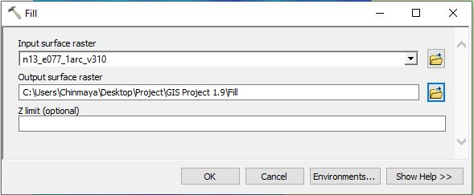

*Figure 3.5.3 — Fill Tool*

**Flow Direction** — computes the downslope flow direction for every cell.

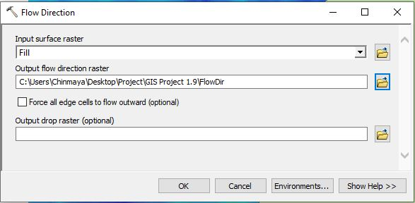

*Figure 3.5.4 — Flow Direction Tool*

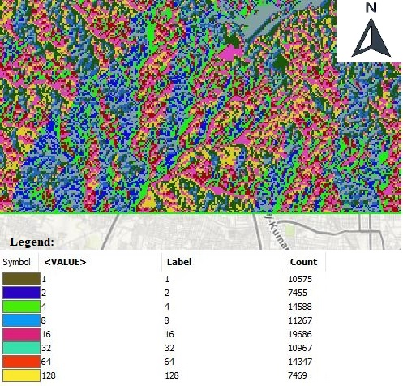

*Figure 3.5.5 — Output of Flow Direction Tool*

**Flow Accumulation** — counts upstream contributing cells; classified with a break value of 1000 to isolate the primary stream network.

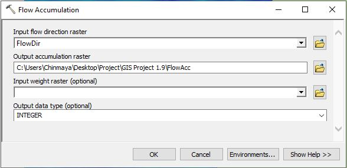

*Figure 3.5.6 — Flow Accumulation Tool*

*Figure 3.5.7 — Output of Flow Accumulation Tool*

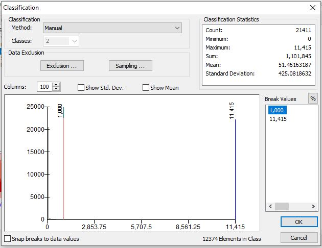

*Figure 3.5.8 — Classification of Flow Accumulation*

**Basin** — delineates the drainage basins as raster, then **Raster to Polygon** converts the selected basin to a vector shapefile.

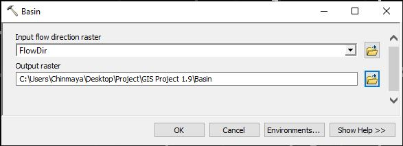

*Figure 3.5.9 — Basin Tool*

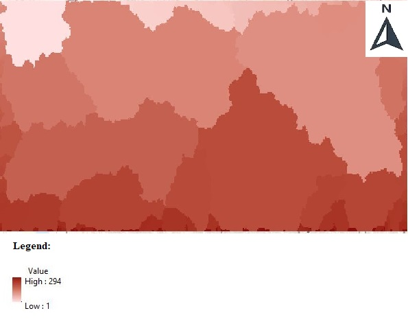

*Figure 3.5.10 — Output of Basin Tool*

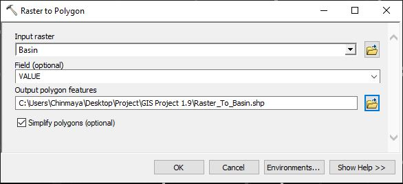

*Figure 3.5.11 — Raster to Polygon Tool*

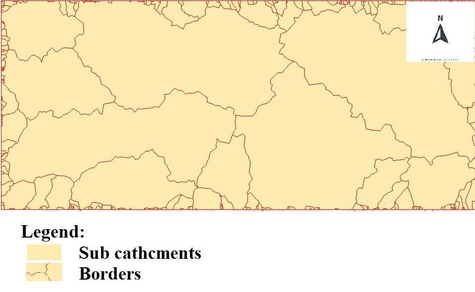

*Figure 3.5.12 — Output of Raster to Polygon Tool*

**Clip** — extracts the single sub-catchment of interest from the full basin raster.

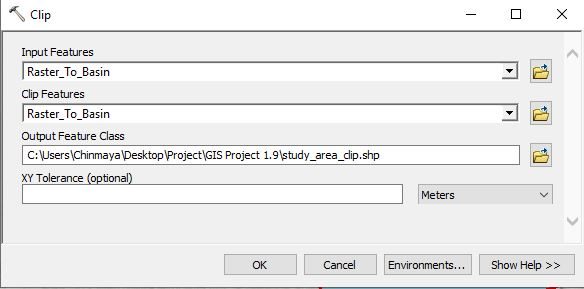

*Figure 3.5.13 — Clip Tool*

*Figure 3.5.14 — Clipped Watershed*

**Raster Calculator** — restricts flow-accumulation values to > 1000, and **Raster to Polyline** converts the resulting streams to vector lines; the study area is then clipped against this stream raster.

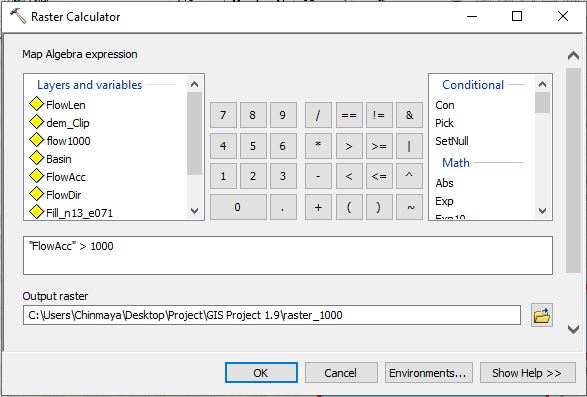

*Figure 3.5.15 — Raster Calculator Tool*

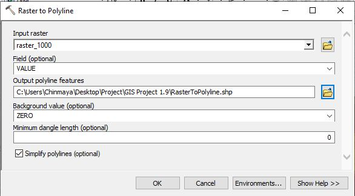

*Figure 3.5.16 — Raster to Polyline Tool*

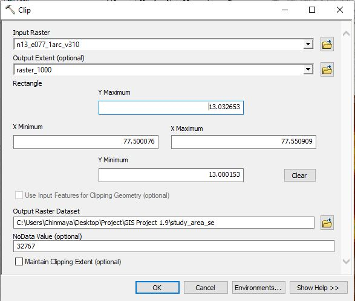

*Figure 3.5.17 — Clipping the Watershed*

## 3. Extract physiographic parameters

**Area** is computed with *Calculate Geometry* in the catchment shapefile's attribute table, giving **11.21 km²**.

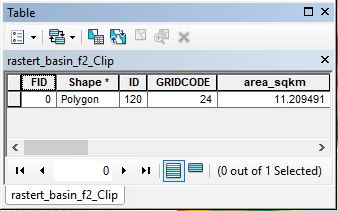

*Figure 3.6.1 — Attribute Table (Area calculation)*

**Stream and centroid lengths** are measured in Google Earth Pro after exporting the shapefiles to KMZ (`Layer To KML`). The longest stream length **L = 3.82 km** is used. The centroid is located by exporting to DWG and running `MASSPROP` in AutoCAD, then re-tracing the centroid point and measuring **L꜀ = 2.13 km** in Google Earth Pro.

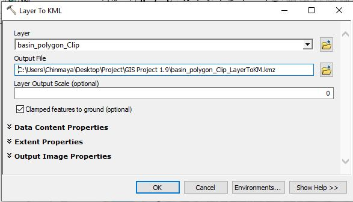

*Figure 3.7.1 — Layer to KML Tool*

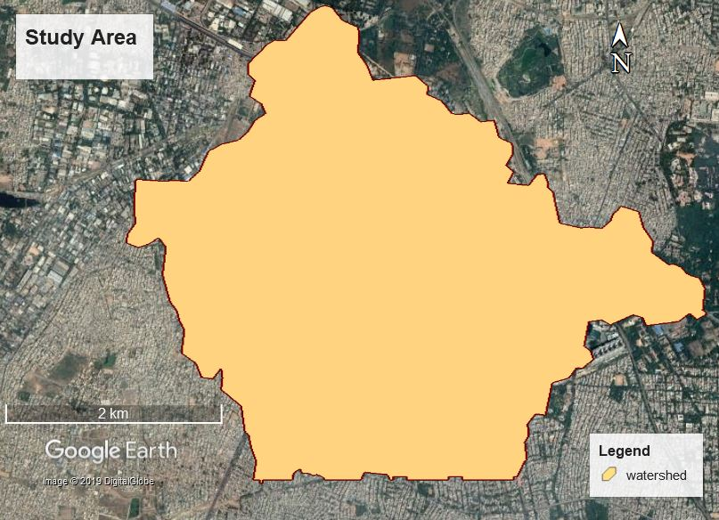

*Figure 3.7.2 — KMZ File of Watershed in Google Earth Pro*

*Figure 3.7.3 — KMZ File of Watershed with Streams in Google Earth Pro*

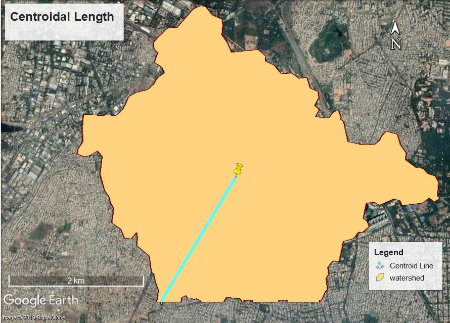

*Figure 3.7.4.1 — Centroidal Length*

## 4. Build the Synthetic Unit Hydrograph

Snyder's empirical relations convert the physiographic parameters into the unit-hydrograph parameters (basin lag, peak discharge, base time, and widths W₅₀ / W₇₅), from which the 4-hour SUH is sketched. See [`results.md`](results.md) for the full derivation.

*Figure 4.2.1 — 4h Synthetic Unit Hydrograph of Study Area*
